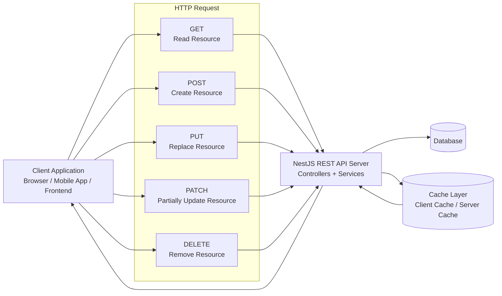

# REST API: Representational State Transfer Style of Programming in a NestJS Context

## 1. Meaning of REST

**REST** stands for **Representational State Transfer**. It is an architectural style for designing networked applications, especially web APIs. In REST, the server exposes **resources** such as users, products, courses, or orders. Clients interact with these resources using standard **HTTP methods**.

In a **NestJS** application, REST APIs are commonly created using:

- **Controllers** to define routes/endpoints
- **Services** to contain business logic
- **DTOs** to validate and structure request data
- **Modules** to organize application features

Example resource:

```text
/users
/users/1
/courses
/courses/10/lessons
```

---

## 2. REST API Diagram



### Simple REST Flow

```text
Client sends HTTP Request  --->  NestJS Controller receives request
                                  |
                                  v
                            Service processes logic
                                  |
                                  v
                            Database / Cache used if needed
                                  |
                                  v
Client receives HTTP Response <--- JSON response returned
```

---

## 3. Core REST Principles

### 3.1 Client-Server Decoupling

REST separates the **client** from the **server**.

- The **client** is responsible for the user interface and user experience.
- The **server** is responsible for data storage, business rules, authentication, and API responses.

This separation allows frontend and backend development to evolve independently.

In NestJS:

```ts
@Controller('users')
export class UsersController {
  @Get()
  findAll() {
    return 'Return all users';
  }
}
```

The client does not need to know how the server internally fetches users. It only needs to call the endpoint.

Common HTTP verbs:

| HTTP Verb | Purpose | Example Endpoint |
|---|---|---|
| `GET` | Read data | `GET /users` |
| `POST` | Create data | `POST /users` |
| `PUT` | Replace full resource | `PUT /users/1` |
| `PATCH` | Partially update resource | `PATCH /users/1` |
| `DELETE` | Delete resource | `DELETE /users/1` |

---

### 3.2 Statelessness

REST APIs are **stateless**. This means every request must contain all the information necessary for the server to process it.

The server should not depend on stored session information from previous requests.

For example, instead of relying on a server session, the client may send an authentication token with every request:

```http
GET /profile HTTP/1.1
Authorization: Bearer <access_token>
```

In NestJS, authentication data is often handled through guards, middleware, or interceptors.

Important idea:

```text
Each request = complete and independent unit of communication
```

Benefits:

- Easier scaling
- Better reliability
- Servers can process requests independently
- Works well with load balancers and distributed systems

---

### 3.3 Cacheability

REST responses should clearly indicate whether they are cacheable.

Caching can happen on:

- The **client side**, such as browser cache
- The **server side**, such as Redis or in-memory cache
- Intermediate systems, such as CDNs or proxy servers

Example HTTP cache header:

```http
Cache-Control: max-age=3600
```

This means the response may be reused for 3600 seconds.

In NestJS, caching can be implemented using cache interceptors or external tools like Redis.

Benefits:

- Faster response times
- Reduced server load
- Better scalability

---

### 3.4 Uniform Interface

A REST API should use a consistent and predictable interface.

This means:

- Resources are identified by URLs
- HTTP verbs describe actions
- Responses are usually represented as JSON
- Status codes communicate results

Example:

```http
GET /users/1
```

Possible response:

```json
{
  "id": 1,
  "name": "Ayesha",
  "role": "student"
}
```

Common HTTP status codes:

| Status Code | Meaning |
|---|---|
| `200 OK` | Request successful |
| `201 Created` | Resource created |
| `400 Bad Request` | Invalid request |
| `401 Unauthorized` | Authentication required |
| `403 Forbidden` | Access denied |
| `404 Not Found` | Resource not found |
| `500 Internal Server Error` | Server error |

---

### 3.5 Layered System

REST supports a layered architecture. A client may not directly communicate with the final server. There may be multiple layers between them.

Possible layers:

```text
Client
  ↓
API Gateway
  ↓
Authentication Layer
  ↓
NestJS Application Server
  ↓
Database / Cache
```

The client does not need to know which layers exist internally.

Benefits:

- Improved security
- Better scalability
- Easier maintenance
- Separation of responsibilities

---

### 3.6 Code on Demand Optional

**Code on Demand** is an optional REST constraint. It means the server can send executable code to the client when needed.

Example:

- JavaScript sent from a server to a browser
- Dynamic client-side scripts

This is optional and not required for most REST APIs.

---

## 4. REST in NestJS

NestJS makes REST development structured and modular.

### Example Controller

```ts
import { Controller, Get, Post, Put, Patch, Delete, Param, Body } from '@nestjs/common';

@Controller('users')
export class UsersController {
  @Get()
  findAll() {
    return 'Get all users';
  }

  @Get(':id')
  findOne(@Param('id') id: string) {
    return `Get user with id ${id}`;
  }

  @Post()
  create(@Body() body: any) {
    return body;
  }

  @Put(':id')
  replace(@Param('id') id: string, @Body() body: any) {
    return { id, ...body };
  }

  @Patch(':id')
  update(@Param('id') id: string, @Body() body: any) {
    return { id, ...body };
  }

  @Delete(':id')
  remove(@Param('id') id: string) {
    return `Delete user with id ${id}`;
  }
}
```

---

## 5. Academic Summary

REST is a widely used architectural style for building web APIs. It focuses on resources, stateless communication, standard HTTP methods, cacheable responses, and a uniform interface. In NestJS, REST APIs are implemented through controllers, services, modules, DTOs, pipes, guards, and interceptors. Following REST principles helps create APIs that are scalable, maintainable, predictable, and easy for clients to consume.

