# Learn NestJS — Academic Notes

> Single-file academic notes for the NestJS chapters covered so far.  
> Diagrams are written in **Mermaid**, because GitHub renders Mermaid diagrams in Markdown preview.  
> More chapters can be appended later.

---

## Master Diagram: NestJS REST Request Flow

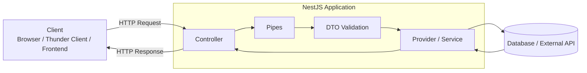

---

# 1. Introduction to NestJS

## 1.1 What is NestJS?

**NestJS** is a progressive Node.js framework used to build scalable backend applications. It uses **TypeScript** by default and provides a structured architecture for building APIs, microservices, WebSocket applications, and more.

NestJS is commonly used to build **REST APIs**. By default, it runs on top of **Express**, but it can also use **Fastify**.

## 1.2 Why NestJS is useful

NestJS gives a professional backend structure. Instead of putting all logic in one file, it separates code into modules, controllers, services, DTOs, pipes, guards, and other building blocks.

Main benefits:

- TypeScript-first framework
- Clean project structure
- Modular architecture
- Dependency injection
- Built-in validation and transformation tools
- Good for large applications
- Good support for REST APIs

## 1.3 Diagram: Basic NestJS Application Structure

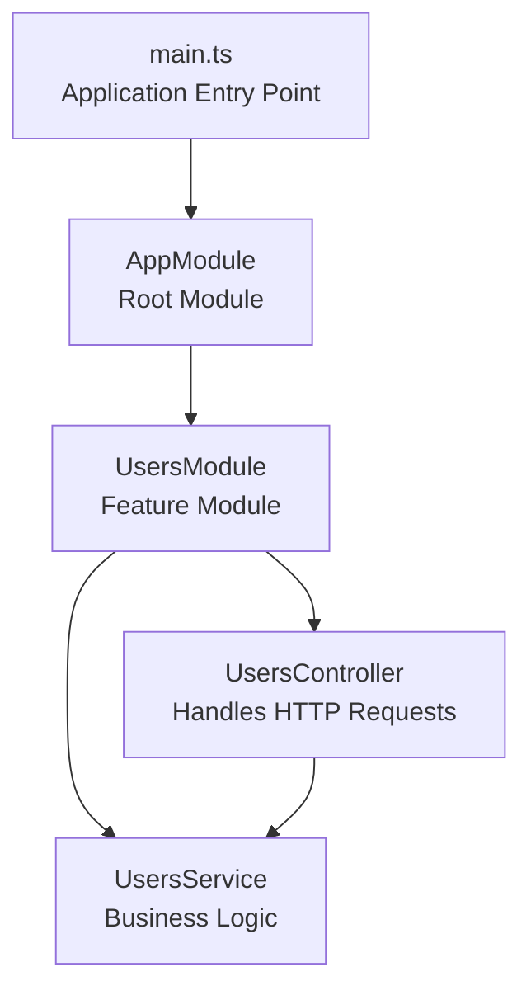

## 1.4 `main.ts`

`main.ts` is the entry point of the NestJS application.

```ts
import { NestFactory } from '@nestjs/core';
import { AppModule } from './app.module';

async function bootstrap() {
  const app = await NestFactory.create(AppModule);
  await app.listen(3000);
}
bootstrap();
```

The app runs at:

```text
http://localhost:3000
```

---

# 2. Understanding Modules, Controllers, Routes, Params, Query, Body, and Providers

## 2.1 What is a Module?

A **module** organizes related parts of an application. A module is created using the `@Module()` decorator.

```ts
import { Module } from '@nestjs/common';
import { UsersController } from './users.controller';
import { UsersService } from './users.service';

@Module({
  controllers: [UsersController],
  providers: [UsersService],
})
export class UsersModule {}
```

## 2.2 Diagram: Module Anatomy

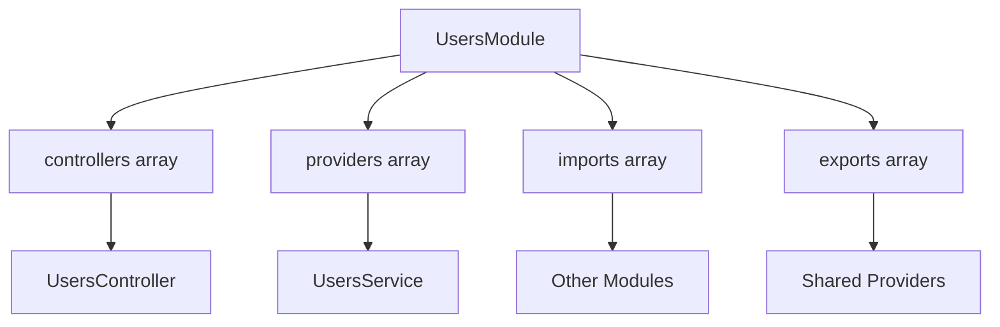

## 2.3 Module metadata

| Property | Purpose |
|---|---|
| `imports` | Imports other modules |
| `controllers` | Registers controllers that handle requests |
| `providers` | Registers services/providers used by the module |
| `exports` | Makes providers available to other modules |

---

## 2.4 Controllers

A **controller** receives HTTP requests and returns responses.

```ts
import { Controller, Get } from '@nestjs/common';

@Controller('users')
export class UsersController {
  @Get()
  getUsers() {
    return 'Get all users';
  }
}
```

This creates the endpoint:

```http
GET /users
```

## 2.5 Diagram: Controller Route Matching

```mermaid
flowchart LR
    A[GET /users] --> B[@Controller('users')]
    B --> C[@Get]
    C --> D[getUsers method]
    D --> E[Response returned to client]
```

---

## 2.6 Routing Decorators

Routing decorators connect HTTP methods to controller methods.

| Decorator | HTTP Method | Common Use |
|---|---|---|
| `@Get()` | GET | Read data |
| `@Post()` | POST | Create data |
| `@Put()` | PUT | Replace data |
| `@Patch()` | PATCH | Partially update data |
| `@Delete()` | DELETE | Delete data |

Example:

```ts
@Controller('users')
export class UsersController {
  @Get()
  findAll() {
    return 'All users';
  }

  @Post()
  create() {
    return 'User created';
  }
}
```

## 2.7 Diagram: REST Verbs in a Users Resource

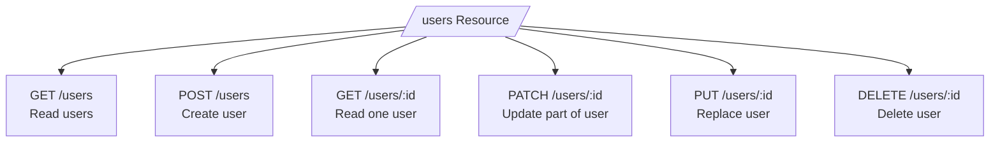

---

## 2.8 Route Params

Route params are dynamic values in the URL path.

Request:

```http
GET /users/45
```

Controller:

```ts
@Get(':id')
getUser(@Param('id') id: string) {
  return `User id is ${id}`;
}
```

`45` becomes the value of `id`.

## 2.9 Diagram: Route Params

```mermaid
flowchart LR
    A[GET /users/45] --> B[Route pattern: /users/:id]
    B --> C[id = 45]
    C --> D[@Param('id')]
    D --> E[Controller method receives id]
```

Important: params arrive as **strings** by default.

---

## 2.10 Query Parameters

Query parameters come after `?` in the URL.

Request:

```http
GET /users?limit=10&offset=20
```

Controller:

```ts
@Get()
getUsers(
  @Query('limit') limit: string,
  @Query('offset') offset: string,
) {
  return { limit, offset };
}
```

Query parameters are useful for pagination, filtering, searching, and sorting.

## 2.11 Diagram: Query Parameters

```mermaid
flowchart LR
    A[GET /users?limit=10&offset=20] --> B[Query String]
    B --> C[limit = 10]
    B --> D[offset = 20]
    C --> E[@Query('limit')]
    D --> F[@Query('offset')]
```

---

## 2.12 Request Body

The request body contains data sent by the client, usually in `POST`, `PUT`, or `PATCH` requests.

Request:

```http
POST /users
Content-Type: application/json

{
  "firstName": "Pema",
  "lastName": "Wangchuk",
  "email": "pema@example.com",
  "password": "Password123"
}
```

Controller:

```ts
@Post()
createUser(@Body() body: any) {
  return body;
}
```

For real applications, avoid `any`. Use DTOs.

## 2.13 Diagram: Body Data Flow

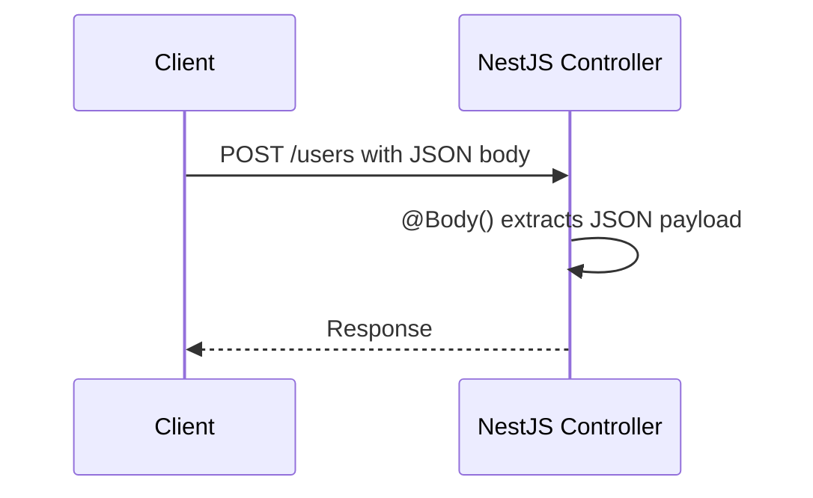

---

## 2.14 Providers

A **provider** is usually a service class that holds business logic.

```ts
import { Injectable } from '@nestjs/common';

@Injectable()
export class UsersService {
  findAll() {
    return ['Pema', 'Sonam'];
  }
}
```

Use service in controller:

```ts
@Controller('users')
export class UsersController {
  constructor(private readonly usersService: UsersService) {}

  @Get()
  findAll() {
    return this.usersService.findAll();
  }
}
```

## 2.15 Diagram: Dependency Injection

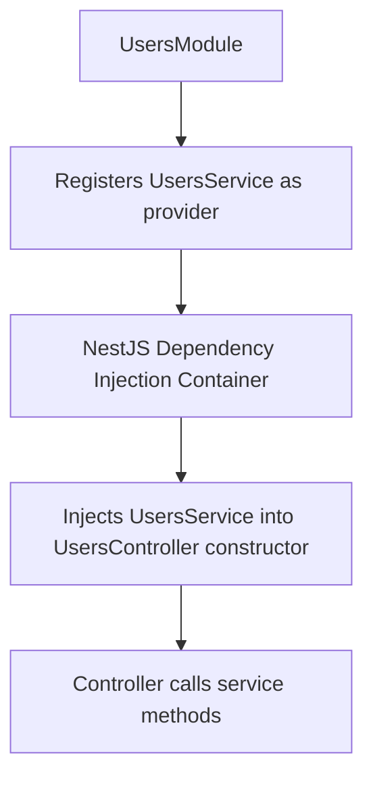

---

# 3. Validations and Pipes

## 3.1 Why validation is needed

Validation checks whether incoming data is correct before the application uses it.

Example invalid data:

```json
{
  "email": "wrong-email",
  "password": "123"
}
```

Validation protects the application from bad input.

## 3.2 Why transformation is needed

HTTP params and query values are usually strings.

Request:

```http
GET /users/45?limit=10
```

Although `45` and `10` look like numbers, they arrive as strings.

Transformation converts values into the expected type.

## 3.3 What is a Pipe?

A **pipe** is a class that runs before the controller method. It can validate or transform incoming data.

## 3.4 Diagram: Pipe Position in Request Lifecycle

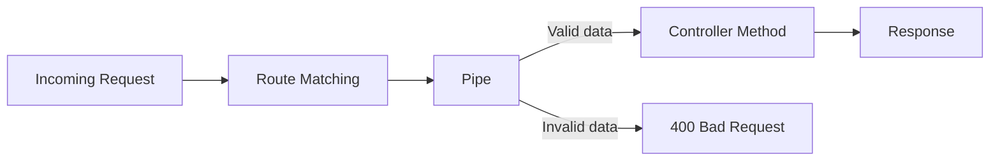

---

## 3.5 Validating Params with `ParseIntPipe`

```ts
@Get(':id')
getUser(@Param('id', ParseIntPipe) id: number) {
  return id;
}
```

Valid request:

```http
GET /users/45
```

Invalid request:

```http
GET /users/abc
```

If `abc` is sent, NestJS returns `400 Bad Request` because `abc` is not a numeric string.

## 3.6 Diagram: `ParseIntPipe`

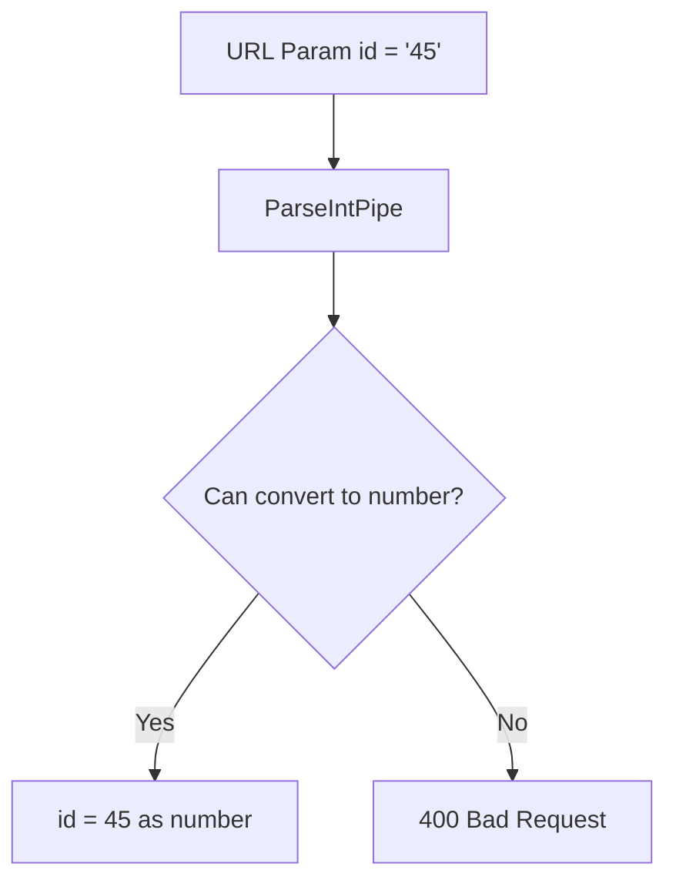

---

## 3.7 Validating Query Parameters

```ts
@Get(':id')
getUser(
  @Param('id', ParseIntPipe) id: number,
  @Query('limit', ParseIntPipe) limit: number,
  @Query('offset', ParseIntPipe) offset: number,
) {
  return { id, limit, offset };
}
```

Request:

```http
GET /users/45?limit=10&offset=20
```

All values are transformed to numbers.

## 3.8 Diagram: Query Validation

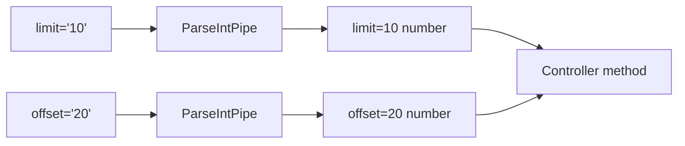

---

# 4. DTOs, Global Pipes, and Avoiding Malicious Requests

## 4.1 What is a DTO?

DTO means **Data Transfer Object**. It defines the shape of data transferred between client and server.

Example:

```ts
export class CreateUserDto {
  firstName!: string;
  lastName!: string;
  email!: string;
  password!: string;
}
```

DTOs make code safer and clearer.

## 4.2 Diagram: DTO Purpose

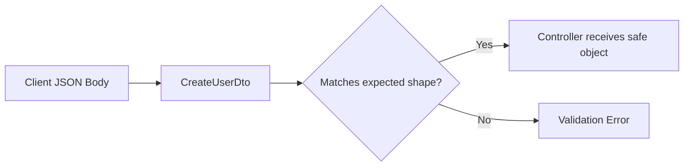

---

## 4.3 DTO with Validation Decorators

Install validation packages:

```bash
npm install class-validator class-transformer
```

Example DTO:

```ts
import { IsEmail, IsString, MinLength } from 'class-validator';

export class CreateUserDto {
  @IsString()
  firstName!: string;

  @IsString()
  lastName!: string;

  @IsEmail()
  email!: string;

  @IsString()
  @MinLength(6)
  password!: string;
}
```

The `!` means TypeScript should not complain about the property not being initialized in the constructor. NestJS will assign it from the request body.

---

## 4.4 Connecting DTO to a Route Method

```ts
@Post()
createUser(@Body() createUserDto: CreateUserDto) {
  return createUserDto;
}
```

This connects the request body to the DTO.

## 4.5 Diagram: DTO Connected to `@Body()`

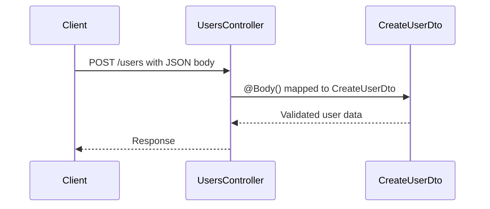

---

## 4.6 Global ValidationPipe

To enable validation globally, configure `ValidationPipe` in `main.ts`.

```ts
import { ValidationPipe } from '@nestjs/common';
import { NestFactory } from '@nestjs/core';
import { AppModule } from './app.module';

async function bootstrap() {
  const app = await NestFactory.create(AppModule);

  app.useGlobalPipes(
    new ValidationPipe({
      whitelist: true,
      forbidNonWhitelisted: true,
      transform: true,
    }),
  );

  await app.listen(3000);
}
bootstrap();
```

## 4.7 Diagram: Global Pipe Protection

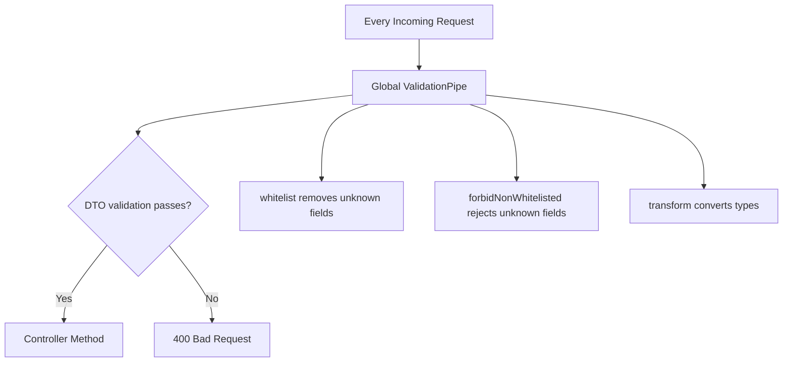

---

## 4.8 Avoiding Malicious Requests

A client may send unwanted fields:

```json
{
  "firstName": "Pema",
  "lastName": "Wangchuk",
  "email": "pema@example.com",
  "password": "Password123",
  "isAdmin": true
}
```

If the DTO does not define `isAdmin`, then `forbidNonWhitelisted: true` rejects the request.

| Option | Meaning |
|---|---|
| `whitelist: true` | Removes properties not defined in DTO |
| `forbidNonWhitelisted: true` | Throws error when extra properties are sent |
| `transform: true` | Converts values to expected types where possible |

## 4.9 Diagram: Malicious Field Rejection

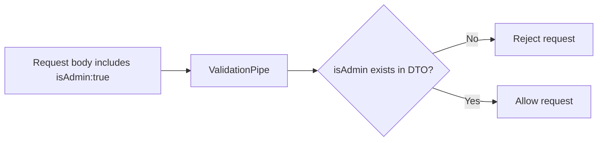

---

## 4.10 Using DTOs with Params

DTOs can also validate route params.

```ts
import { Type } from 'class-transformer';
import { IsInt } from 'class-validator';

export class GetUserParamDto {
  @Type(() => Number)
  @IsInt()
  id!: number;
}
```

Controller:

```ts
@Get(':id')
getUser(@Param() params: GetUserParamDto) {
  return params.id;
}
```

## 4.11 Diagram: Params DTO

```mermaid
flowchart LR
    A[GET /users/45] --> B[@Param]
    B --> C[GetUserParamDto]
    C --> D[@Type converts string to number]
    D --> E[@IsInt validates integer]
    E --> F[Controller receives params.id]
```

---

# 5. Using Mapped Types to Avoid Code Duplication

## 5.1 The problem

When building APIs, DTOs often look similar.

Example create DTO:

```ts
export class CreateUserDto {
  firstName!: string;
  lastName!: string;
  email!: string;
  password!: string;
}
```

For update, the same fields may be needed, but optional. Writing them again duplicates code.

## 5.2 Diagram: DTO Duplication Problem

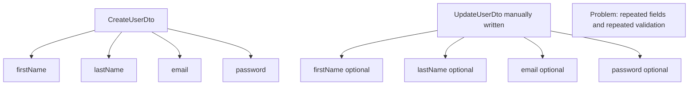

---

## 5.3 Mapped Types

Mapped types create new DTOs from existing DTOs.

Install package:

```bash
npm install @nestjs/mapped-types
```

Common helpers:

| Helper | Purpose |
|---|---|
| `PartialType()` | Makes all fields optional |
| `PickType()` | Selects only chosen fields |
| `OmitType()` | Removes chosen fields |
| `IntersectionType()` | Combines DTOs |

## 5.4 Diagram: Mapped Types Overview

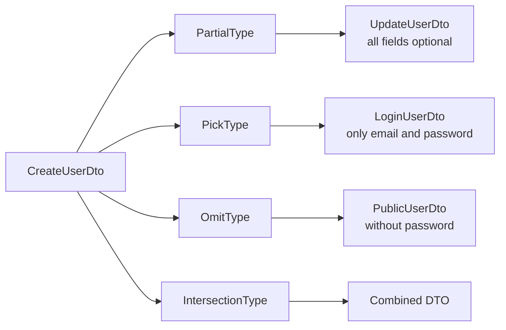

---

## 5.5 `PartialType()` Example

```ts
import { PartialType } from '@nestjs/mapped-types';
import { CreateUserDto } from './create-user.dto';

export class UpdateUserDto extends PartialType(CreateUserDto) {}
```

This creates an update DTO where every property from `CreateUserDto` is optional.

Use it with PATCH:

```ts
@Patch(':id')
updateUser(
  @Param('id', ParseIntPipe) id: number,
  @Body() updateUserDto: UpdateUserDto,
) {
  return { id, updateUserDto };
}
```

## 5.6 Diagram: `PartialType()` for PATCH

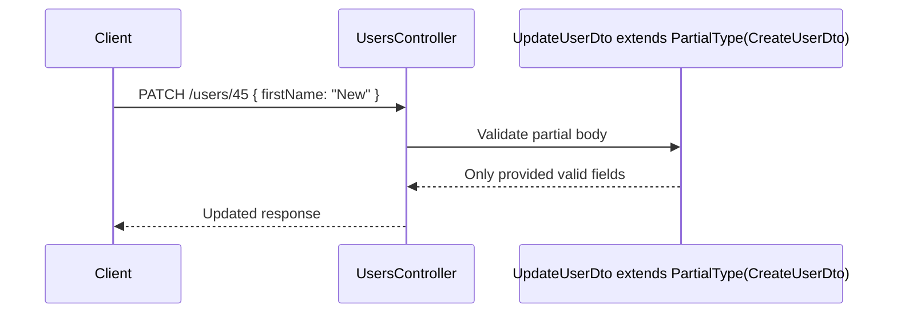

---

## 5.7 `PickType()` Example

Use `PickType()` when only selected properties are needed.

```ts
import { PickType } from '@nestjs/mapped-types';
import { CreateUserDto } from './create-user.dto';

export class LoginUserDto extends PickType(CreateUserDto, [
  'email',
  'password',
] as const) {}
```

This creates a DTO with only `email` and `password`.

## 5.8 Diagram: `PickType()`

```mermaid
flowchart LR
    A[CreateUserDto<br/>firstName, lastName, email, password] --> B[PickType email + password]
    B --> C[LoginUserDto<br/>email, password]
```

---

## 5.9 `OmitType()` Example

Use `OmitType()` when you want to remove some fields.

```ts
import { OmitType } from '@nestjs/mapped-types';
import { CreateUserDto } from './create-user.dto';

export class PublicUserDto extends OmitType(CreateUserDto, [
  'password',
] as const) {}
```

This creates a DTO without `password`.

## 5.10 Diagram: `OmitType()`

```mermaid
flowchart LR
    A[CreateUserDto<br/>firstName, lastName, email, password] --> B[OmitType password]
    B --> C[PublicUserDto<br/>firstName, lastName, email]
```

---

# Practical Request Examples

## GET with Params and Query

```http
GET http://localhost:3000/users/45?limit=10&offset=20
Accept: application/json
```

```ts
@Get(':id')
getUser(
  @Param('id', ParseIntPipe) id: number,
  @Query('limit', ParseIntPipe) limit: number,
  @Query('offset', ParseIntPipe) offset: number,
) {
  return { id, limit, offset };
}
```

## POST with DTO

```http
POST http://localhost:3000/users
Content-Type: application/json

{
  "firstName": "Pema",
  "lastName": "Wangchuk",
  "email": "pema.wangchuk@example.com",
  "password": "Password123"
}
```

```ts
@Post()
createUser(@Body() createUserDto: CreateUserDto) {
  return createUserDto;
}
```

---

# Common Beginner Errors

## 1. `Validation failed numeric string is expected`

This usually happens when `ParseIntPipe` expects a numeric value but receives a wrong or missing value.

Example:

```ts
@Query('page', ParseIntPipe) page: number
```

But request sends:

```http
GET /users?limit=10&offset=20
```

There is no `page`, so validation fails.

## 2. Property has no initializer

Error:

```text
Property 'firstName' has no initializer and is not definitely assigned in the constructor.
```

Fix:

```ts
firstName!: string;
```

This is common in DTO classes.

## 3. Response opens on right side in VS Code

This is controlled by the extension, not by NestJS. Thunder Client and Yak show responses differently.

---

# Chapters To Be Added Later

The following chapters are intentionally reserved for future updates.

## 6. Services and Dependency Injection in Depth

_To be added later._

```mermaid
flowchart LR
    A[Controller] --> B[Service]
    B --> C[Repository / Database]
```

## 7. Exception Filters

_To be added later._

```mermaid
flowchart LR
    A[Error thrown] --> B[Exception Filter]
    B --> C[Formatted Error Response]
```

## 8. Guards and Authentication

_To be added later._

```mermaid
flowchart LR
    A[Request] --> B[Guard]
    B -->|Allowed| C[Controller]
    B -->|Denied| D[403 Forbidden]
```

## 9. Interceptors

_To be added later._

```mermaid
flowchart LR
    A[Request] --> B[Interceptor Before]
    B --> C[Controller]
    C --> D[Interceptor After]
    D --> E[Response]
```

## 10. Middleware

_To be added later._

```mermaid
flowchart LR
    A[Request] --> B[Middleware]
    B --> C[Route Handler]
```

## 11. Database Integration

_To be added later._

```mermaid
flowchart LR
    A[Service] --> B[ORM]
    B --> C[(Database)]
```

## 12. TypeORM / Prisma

_To be added later._

```mermaid
flowchart LR
    A[NestJS Service] --> B[Prisma or TypeORM]
    B --> C[(Database Tables)]
```

## 13. Authentication with JWT

_To be added later._

```mermaid
flowchart LR
    A[Login] --> B[Validate User]
    B --> C[Generate JWT]
    C --> D[Client stores token]
    D --> E[Send token with requests]
```

## 14. File Uploads

_To be added later._

```mermaid
flowchart LR
    A[Client uploads file] --> B[File Interceptor]
    B --> C[Controller]
    C --> D[Storage]
```

## 15. Testing in NestJS

_To be added later._

```mermaid
flowchart LR
    A[Unit Test] --> B[Service]
    C[E2E Test] --> D[HTTP Endpoint]
```

---

# Final Summary

NestJS is a structured backend framework for building scalable applications. The chapters covered so far explain how requests enter the application, how controllers handle routes, how modules organize features, how providers contain business logic, how pipes validate and transform values, how DTOs protect request data, and how mapped types reduce duplicate DTO code.

Future chapters can be added to this same file while keeping one academic learning document.
